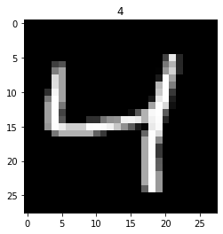

# HANDWRITTEN DIGIT RECOGNITION
## Image Recognition of MNIST Digit Dataset with Convolutional Neural Networks.

#

## DATASET
dataset contain of 60000 training data and 10000 test data. each data consist of 28x28 array of integer, represent pixel value from 0 to 255 (greyscale)

## TABLE OF CONTENT
### - PREPROCESSING
### - MODEL BUILDING
### - MODEL TRAINING
### - RESULT-CONCLUSION

#

## PREPROCESSING
preprocess data to be feed to the model.

- preprocess feature: scale feature to 0-1 scale

- preprocess label:

train data label balanced, all we need is to encode the label (to numerical)

#

## MODEL BUILDING
build CNN model with tensorflow/keras.

### Model Architecture: 
> input (28 x 28) -> 

> Conv2D(relu) -> MaxPooling2D -> Dropout ->

> Conv2D(relu) -> MaxPooling2D -> Dropout ->

> Flatten -> Dense(relu) -> Dropout -> Dense(softmax) -> out

### Model:

    Model: "sequential"
    _________________________________________________________________
    Layer (type)                Output Shape              Param #   
    =================================================================
    conv2d (Conv2D)             (None, 25, 25, 32)        544       
                                                                    
    max_pooling2d (MaxPooling2D  (None, 12, 12, 32)       0         
    )                                                               
                                                                    
    dropout (Dropout)           (None, 12, 12, 32)        0         
                                                                    
    conv2d_1 (Conv2D)           (None, 9, 9, 32)          16416     
                                                                    
    max_pooling2d_1 (MaxPooling  (None, 4, 4, 32)         0         
    2D)                                                             
                                                                    
    dropout_1 (Dropout)         (None, 4, 4, 32)          0         
                                                                    
    flatten (Flatten)           (None, 512)               0         
                                                                    
    dense (Dense)               (None, 256)               131328    
                                                                    
    dropout_2 (Dropout)         (None, 256)               0         
                                                                    
    dense_1 (Dense)             (None, 10)                2570      
                                                                    
    =================================================================
    Total params: 150,858
    Trainable params: 150,858
    Non-trainable params: 0
    _________________________________________________________________

# 

## MODEL TRAINING
feed data to model and train.

    epoch = 10
    batch = 32

#

### RESULT
we've build CNN model to recognize handwritten digit image. 

Accuracy result:

    Train (10 epoch)  : loss: 0.0288 - accuracy: 0.9906

    Test              : loss: 0.0285 - accuracy: 0.9934